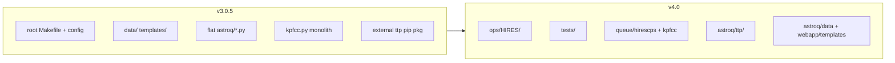

# PR Title

Release v4.0.0: repository reorganization, vendored TTP, HIRES-CPS queue, and schema modernization

---

# PR Body (copy everything below this line into GitHub)

v4.0.0 is a major internal refactor and HIRES operationalization release. It preserves the semester MILP and night TTP pipeline but changes repo layout, data schemas, on-disk outputs, and several solver behaviors.

**Baseline:** `v3.0.5` → `refactor-v4.0` (179 commits, 80 files, +10,859 / −7,554 LOC)

> **Note on diff scale:** A large share of the positive line count is **formatting, not new logic**. Commit `7c27f34` ("ran ruff formatter") reformatted 17 files (+5,860 / −3,483 LOC), chiefly by wrapping long lines in `splan.py`, `ttp/model.py`, `ttp/plot.py`, and `webapp.py`. Excluding that pass, the net functional delta is closer to **+8,500 / −7,100 LOC** across the remaining ~160 commits.

---

## Summary

- Reorganize the repo into **`astroq/` (library)**, **`ops/HIRES/` (operational Makefiles)**, and **`tests/` (pytest)**.
- Introduce a **queue subpackage architecture** (`hirescps`, `kpfcc`) with shared `astroq/queue/base.py` and factory registry in `astroq/queue/__init__.py`.
- **Vendor TTP** under `astroq/ttp/` with a new solver objective (idle-time penalty), window-based feasibility (no synthetic Gap rows), and a DataFrame schedule API.
- **Rewrite Access** with twilight gating, `build_windows()`, and queue-driven pointing limits.
- **Ship HIRES-CPS prep** (`astroq prep hirescps`), proper-motion starlists, and live allocation crossmatch.
- **Modernize data schemas** (`starname` → `target`, simplified `past.csv`, new `semester_plan.csv` columns).

---

## Motivation

Through v3.0.5, AstroQ coupled library code, operational scripts, and static assets at the repo root. A single root `Makefile` and `config_template.ini` worked for KPF-CC, but HIRES 2026A operations outgrew that layout — multiple semester workdirs, live schedule pulls, and instrument-specific prep needed a clearer home.

Night and semester integration had also grown brittle around monolithic modules (`kpfcc.py`, `history.py`, `io.py`) and an external `ttp` pip dependency. The legacy night path injected synthetic Gap rows for unallocated slots and scrubbed them post-solve; reporting was split across `io.py`, `runReport.txt`, and dense serialized CSVs.

v4.0 consolidates instrument knowledge into Queue subclasses, folds past history directly onto `SemesterPlanner.requests_frame`, vendors TTP for reproducible night solves, and separates **code** (`astroq/`), **ops** (`ops/HIRES/`), and **tests** (`tests/`). The semester MILP formulation is largely preserved; the night planner and observability layer are substantially modernized.

---

## Code organization

### Repository layout (v3.0.5 vs v4.0)

#### v3.0.5 (`main` / tag `v3.0.5`) — old tree

```text
AstroQ/                          (repo root)
├── Makefile                     ──► ops/HIRES/2026B/Makefile
├── config_template.ini          ──► ops/HIRES/common/config_template.ini
├── check_night_plans.py         ──► astroq/scripts/check_night_plans.py
├── test_sample.py               ──► tests/test_sample.py
├── data/                        ──► astroq/data/
│   ├── maunakea_weather_loss_data.csv
│   ├── template_OB.json
│   └── template_OB_annotated.json
├── templates/                   ──► astroq/webapp/templates/
│   ├── admin.html
│   ├── homepage.html
│   ├── index.html
│   ├── nightplan.html
│   ├── semesterplan.html
│   └── star.html
├── docs/                        (updated, not moved)
├── examples/                    (updated, not moved)
└── astroq/
    ├── __init__.py
    ├── access.py
    ├── benchmarking.py
    ├── cli.py
    ├── driver.py
    ├── history.py               (deleted → splan.py)
    ├── io.py                    (deleted → splan.py + queue starlists)
    ├── nplan.py
    ├── plot.py
    ├── splan.py
    ├── webapp.py                ──► astroq/webapp/app.py
    └── queue/
        ├── kpfcc.py             (deleted → queue/kpfcc/{prep,queue,starlist}.py)
        └── update_backup_OBs.py ──► astroq/scripts/update_backup_OBs.py

External dependency: pip-installed ttp package (not in repo)
```

#### v4.0 (`refactor-v4.0`) — new tree

```text
AstroQ/                          (repo root)
├── ops/                         (new — operational tooling)
│   └── HIRES/
│       ├── common/
│       │   └── config_template.ini
│       ├── 2026A/
│       │   ├── Makefile
│       │   └── request_urls.csv
│       └── 2026B/
│           ├── Makefile
│           └── request_urls.csv
├── tests/                       (new — pytest suite)
│   ├── conftest.py              (sandbox fixture)
│   └── test_sample.py
├── docs/                        (updated; history.rst + io.rst removed)
├── examples/                    (updated schemas)
└── astroq/                      (installable package)
    ├── __init__.py
    ├── access.py
    ├── benchmarking.py
    ├── cli.py
    ├── driver.py
    ├── nplan.py
    ├── plot.py
    ├── splan.py
    ├── data/                    (moved from repo root)
    │   ├── maunakea_weather_loss_data.csv
    │   ├── template_OB.json
    │   └── template_OB_annotated.json
    ├── queue/                   (new subpackage architecture)
    │   ├── __init__.py          (QUEUE_REGISTRY factory)
    │   ├── base.py              (abstract Queue)
    │   ├── hirescps/            (new instrument queue)
    │   │   ├── prep.py
    │   │   ├── queue.py
    │   │   └── starlist.py
    │   └── kpfcc/               (split from monolithic kpfcc.py)
    │       ├── prep.py
    │       ├── queue.py
    │       └── starlist.py
    ├── scripts/                 (new)
    │   ├── check_night_plans.py
    │   ├── ttp_keck1.py
    │   └── update_backup_OBs.py
    ├── ttp/                     (new — vendored TTP MILP)
    │   ├── model.py
    │   └── plot.py
    └── webapp/                  (promoted from single module)
        ├── app.py
        └── templates/
            ├── *.html
            └── partials/*.j2    (new datatable partials)
```



### Deleted modules and replacements

| Removed | Absorbed into |
|---------|---------------|
| `astroq/history.py` | `astroq/splan.py` — `_load_past()` / `_attach_past_columns()` |
| `astroq/io.py` | `SemesterPlanner.build_schedule()`, `to_string()`, `log_report()`; starlist writers in `astroq/queue/*/starlist.py` |
| `astroq/queue/kpfcc.py` | `astroq/queue/kpfcc/{prep,queue,starlist}.py` |
| Root `test_sample.py` | `tests/test_sample.py` + `tests/conftest.py` |
| `docs/individual_rsts/history.rst`, `io.rst` | Removed; logic documented in `getting_started.rst` |

### New subpackages

| Path | Role |
|------|------|
| `astroq/queue/hirescps/` | Full HIRES-CPS queue — prep, descriptor, starlist writer (new on `main`) |
| `astroq/queue/kpfcc/` | KPF-CC queue split from monolithic `kpfcc.py` |
| `astroq/queue/base.py` + `__init__.py` | Abstract `Queue` + `QUEUE_REGISTRY` factory (`from_config`, `from_name`) |
| `astroq/ttp/` | Vendored `TTPModel`, plotting adapters |
| `astroq/webapp/` | Flask app + co-located Jinja templates |
| `astroq/scripts/` | `check_night_plans.py`, `ttp_keck1.py`, `update_backup_OBs.py` |
| `ops/HIRES/` | Semester-specific Makefiles + shared `ops/HIRES/common/config_template.ini` |

### Reviewer focus areas

1. **Queue factory + h5 rehydration** — `astroq/queue/__init__.py`; `SEMESTER_PLANNER_H5_SCHEMA = 4`, `NIGHT_PLANNER_H5_SCHEMA = 6`
2. **Access pipeline** — `compute_night()` → per-constraint AND → `build_windows()` in `astroq/access.py`
3. **TTP boundary** — QTable in, DataFrame `schedule`/`nodes`/`arcs` out (`astroq/ttp/model.py`, `astroq/nplan.py`)
4. **Driver dispatch** — `astroq/driver.py` prep/plan-semester/plan-night branches and output writers

---

## Refactoring: `access.py`

`access.py` carries much of the observability-layer change in v4.0: how per-target, per-(night, slot) feasibility is computed and handed off to the night planner.

### From Keck-hardcoded orchestrator to queue-driven pipeline

**v3.0.5 shape:** a single class with a 17-argument `__init__` that `SemesterPlanner` populated by hand (`past_history` dict from `history.py`, `slots_needed_for_exposure_dict`, `run_band3`, `observatory_string`, date grids, etc.). Keck pointing limits were module-level constants (`nays_az_low`, `tel_min`, …). A monolithic `produce_ultimate_map()` built and AND-reduced all cubes. Twilight handling for band-3 lived outside Access in `splan.add_twilights()` / `build_twilight_allocation_file()`.

**v4.0 shape:** a self-contained observability engine constructed either standalone or via `Access.from_planner(planner)`.

| Aspect | v3.0.5 | v4.0 |
|--------|--------|------|
| Construction | 17 positional args passed from `splan` | `(queue, request_frame, semester_start, semester_length, slot_size)` + keyword opts |
| Telescope knowledge | Hardcoded Keck limits in `access.py` | `queue.is_accessible()` + `queue.access_constraints` |
| Constraint dispatch | Fixed set inside `produce_ultimate_map()` | `build_access()` calls `compute_<name>()` only for names in `queue.access_constraints`; others default all-True |
| Canonical schema | Implicit field names | `SUPPORTED_CONSTRAINTS` tuple: `altaz, future, moon, night, custom, inter, allocated, clear` |
| Twilight | Not in Access; band-3 twilight injected in `splan` | New `compute_night()` — nautical twilight (`horizon = -12°`) per slot |
| Internight cadence | `compute_inter(past_history)` — `StarHistory` dict from `history.py` | `compute_inter()` reads `past_date_last_observed` off `request_frame` |
| Multi-slot visits | Separate `slots_needed_for_exposure_dict` | `t_visit_slots` column on `request_frame`; `build_access()` derives `is_observable` (exposure fits before night-end) from `is_observable_now` |
| Night planner handoff | None — TTP used gap rows | New `build_windows()` sets `first_available`, `last_available`, `has_observable` `(ntargets, nnights)` arrays for `nplan.run_ttp` |
| Optional inputs | Always required paths | `allocation_file=None` / `custom_file=None` → no-op (all-True cube); supports standalone Access use |
| Observability export | `observability(requests_frame, access)` | `observability(is_observable)` — long-form `(unique_id, d, s)` DataFrame |
| Date grid | Built inside `splan`, passed in | `build_date_dictionary()` module helper; `Access` owns `all_dates_array` / `all_dates_dict` |

**Pipeline (v4.0):**

```text
for name in queue.access_constraints:
    cubes[name] = compute_<name>()     # each → (ntargets, nnights, nslots) bool
is_observable_now = AND(all SUPPORTED_CONSTRAINTS cubes)
is_observable     = dilate is_observable_now by t_visit_slots per target
build_windows(is_observable)         # → first_available, last_available
return recarray(is_* fields, is_observable_now, is_observable)
```

**Removed from `access.py`:** `produce_ultimate_map()`, `build_twilight_allocation_file()` (band-3 twilight expansion moved to `astroq/queue/kpfcc/prep.py` at prep time).

---

## Refactoring: `splan.py`

`splan.py` owns semester-level scheduling. The Gurobi MILP constraints are largely the same (Lubin et al. 2025 formulation); what changed is how inputs are loaded, how `Access` is wired in, and how results are persisted.

### Slimmer planner with data on `requests_frame`

**v3.0.5 shape:** ~1,130-line monolith. `__init__(cf, run_band3)` inlined config parsing, path resolution, CSV loading, slot arithmetic, past-history processing (`history.process_star_history`), observability construction, and Gurobi model setup. Reporting and schedule serialization delegated to `astroq/io.py`. Many parallel dict attributes (`past_history`, `slots_needed_for_exposure_dict`, `starname`-indexed lookups) duplicated information already in DataFrames.

**v4.0 shape:** ~1,070 lines after ruff reformat (net slimmer in logic). `__init__(cf)` only — `run_band3` removed. Responsibilities split into named private methods; `requests_frame` is the single source of truth for per-target derived state.

| Aspect | v3.0.5 | v4.0 |
|--------|--------|------|
| Entry point | `SemesterPlanner(cf, run_band3)` | `SemesterPlanner(cf)` |
| Instrument config | `[global] observatory` string | `queue = astroq.queue.from_config(config)` |
| Path resolution | Repeated inline `os.path.join(workdir, …)` | `_resolve_path(key)` for all `[data]` files |
| Past history | `history.process_star_history()` → `past_history` dict | `_load_past()` → `past_df`; `_attach_past_columns()` → columns on `requests_frame` |
| Slot sizing | `_build_slots_required_dictionary()`, `_calculate_slot_info()` | `_attach_slot_columns()` via `queue.visit_seconds()` → `t_visit_slots`, `tau_intra_slots` |
| Observability | `_build_observability()` constructs `Access(…17 args…)` | `Access.from_planner(self)` → `build_access()` → `observability()` |
| Band-3 fillers | `add_twilights()` mutates allocation for filler targets | Removed; twilight expansion at prep time |
| Duplicate IDs | Silent until Gurobi `addVars` failure | Explicit `ValueError` on duplicate active `unique_id` |
| Schedule output | `io.serialize_schedule()` + dense `serialized_outputs_dense_v{1,2}.csv` | `build_schedule()` → sparse `semester_plan.csv` (`unique_id, d, s, target`) |
| Run report | `io.build_fullness_report()` → `runReport.txt` | `to_string()` + `log_report()` at INFO |
| Round finalization | Scattered across `run_model` / `serialize_results_csv` | `_finalize_round()` → `build_schedule`, `log_report`, `write_request_selected`, `to_hdf5` |
| h5 persistence | Pickle-heavy, no schema version | `SEMESTER_PLANNER_H5_SCHEMA = 4`; stores `config_ini_text`, `past_df`, `access_record`, `schedule` |
| Date properties | Instance attrs set in `__init__` | `@property` delegating to `access_obj` where appropriate |

**Past columns attached to `requests_frame` (replaces `history.py`):**

- `past_nights_observed`, `past_n_exposures`, `past_date_last_observed` — aggregated from raw `past_df` by `unique_id` (UT night = `timestamp[:10]`)
- `desired_max_obs`, `absolute_max_obs` — night caps for Round 1 / bonus round; collapse to `past_nights_observed` when over-observed

**Gurobi model unchanged in spirit:** `Yrds`, `Wrd`, `theta` variables and constraint methods (`constraint_throttle`, `constraint_enforce_internight_cadence`, multivisit/intranight cadence, etc.) read from `requests_frame` and `joiner` as before — but slot counts now come from `t_visit_slots` / `tau_intra_slots` columns rather than side dicts.

**Removed dependencies:** `import astroq.history`, `import astroq.io`; `serialize_results_csv()`, `add_twilights()`, `_build_date_dictionary()`, `_build_slots_required_dictionary()`.

---

## New functionality

### Night planner (vendored TTP)

- External `ttp` pip package replaced by vendored `astroq/ttp/model.py`; night path always calls `NightPlanner.run_ttp()`.
- **No Gap rows:** `Access.is_allocated` plus per-target `first_available` / `last_available` windows replace synthetic gap injection and post-solve scrubbing.
- **Idle-time penalty** objective maximizes scheduled science while penalizing slew and inter-visit idle time; idle is deferred toward the end of the night for observer padding.
- **Symmetry-breaking / early-start constraints** prevent exposures from starting before true availability (fixes edge case when `first_available` is after night start).
- **Rise-constraint fix:** accessibility lower bound uses `t_early + t_visit`, not just `t_early`.
- **h5 schema bump:** `NIGHT_PLANNER_H5_SCHEMA = 6` — existing `night_planner.h5` files must be regenerated.

Night outputs retained: `ObserveOrder_<date>.txt`, `script_<date>_nominal.txt`, `night_planner.h5`.

### Access and semester planning (user-visible effects)

See **Refactoring: `access.py`** and **Refactoring: `splan.py`** above for the full before/after. Operator-facing highlights:

- Nautical twilight now gates semester slots (`compute_night`); also used in seasonality/football plots.
- Night planner consumes `first_available` / `last_available` windows — no synthetic Gap rows.
- `past.csv` simplified; past caps flow through `requests_frame` columns into the MILP.
- `runReport.txt` dropped; semester stats logged at INFO. Dense serialized CSVs dropped; use `semester_plan.csv`.

### HIRES-CPS prep and starlists

- New CLI: **`astroq prep hirescps`** (`astroq/cli.py`, `astroq/driver.py`).
- Live Keck schedule pull + allocation crossmatch (`astroq/queue/hirescps/prep.py`); pass `-ru` to `astroq prep hirescps` (Makefiles default to `ops/HIRES/2026A/request_urls.csv`).
- Simplified HIRES past pull: writes `unique_id, target, timestamp, exposure_time` (+ optional `junk`).
- **Proper-motion propagation** in `format_hires_row()`: `SkyCoord.apply_space_motion()` to observing night; writes `epoch=<jyear>` when PM ≠ 0.
- **BACKUPS section** in nightly script: all active requests + V<8 subset with `obs=N/M` tokens from past history.

### Webapp

- Promoted from `astroq/webapp.py` to `astroq/webapp/app.py` with co-located templates.
- Night plots use `astroq/ttp/plot.py` against the new DataFrame schedule API.
- Slew animation draws `inaccessible_zones` from `night_planner.queue` (not hardcoded Keck limits).
- URL routes use **`target`** instead of `starname`.
- New **`download_nightplan`** route serves `script_<date>_nominal.txt`.
- Loads planners from h5 (`SemesterPlanner.from_hdf5`, `NightPlanner.from_hdf5`); pickle-based loading removed.

### Benchmark

- Vectorized toy model in `astroq/benchmarking.py` (Lubin et al. 2025 program table, RNG seed 24).
- `bench()` API simplified — no `run_band3` flag; uses `SemesterPlanner(cf)` directly.

---

## Breaking changes / migration (v3.0.5 → v4.0.0)

### `config.ini`

| v3.0.5 | v4.0.0 action |
|--------|---------------|
| `[global] observatory = Keck Observatory` | Remove; use `[global] queue = hirescps` or `kpfcc` |
| `[global] instrument` (implicit) | Queue owns observatory + instrument |
| `[global] UTCoffset = -10` | Remove; past dates derived as UT `timestamp[:10]` |
| `slot_size = 5` (template default) | Default now **`3`** — verify intent for your queue |
| `[semester] max_solve_time = 300` | Unchanged |
| `[night] max_solve_time = 120` | Default now **`300`** |
| Root `config_template.ini` | Use `ops/HIRES/common/config_template.ini` |

### CSV schemas

| File | v3.0.5 | v4.0.0 |
|------|--------|--------|
| `request.csv` | `starname` column | **`target`** column (prep accepts legacy `starname` with warning) |
| `custom.csv` | `unique_id, starname, start, stop` | `unique_id, target, start, stop` |
| `past.csv` | `id, target, semid, timestamp, exposure_start_time, exposure_time, observer` | `unique_id, target, timestamp, exposure_time` (+ optional `junk`) |
| `semester_plan.csv` | `r, d, s, name` | `unique_id, d, s, target` |

### Removed outputs

Update any downstream scripts or dashboards that read these files:

| Removed file | Replacement |
|--------------|-------------|
| `runReport.txt` | Semester statistics logged at INFO via `SemesterPlanner.log_report()` |
| `serialized_outputs_dense_v1.csv`, `v2.csv` | `semester_plan.csv` |
| `ttp_prepared.csv` | No longer written |
| `TTPstatistics.txt` | Night statistics logged via `TTPModel.to_string()` |

### Ops workflow

- Run HIRES Makefiles from **`ops/HIRES/2026A/`** or **`ops/HIRES/2026B/`**, not repo root.
- Set **`CC_OUTPUT_PATH`** and run `astroq` commands from repo root (see `README.md`).
- Replace imports of `astroq.io`, `astroq.history`, and root-level `check_night_plans.py`.
- **Regenerate all cached h5 artifacts** — semester schema 4, night schema 6.

---

## Test plan

- [ ] `pytest -v` from repo root (sandbox fixture in `tests/conftest.py` prevents dirtying the tree)
- [ ] `astroq plan-semester` + `astroq plan-night` on `examples/hello_world/`
- [ ] `astroq bench` produces expected toy semester plan
- [ ] HIRES Makefile smoke: `ops/HIRES/2026A/` target for a known date (e.g. 2026-05-05 band1)
- [ ] `astroq webapp` — semester + night pages, slew animation, `download_nightplan`
- [ ] `requests_vs_schedule` invariant check after night solve (`astroq/driver.py`)
- [ ] Regenerate any cached `.h5` artifacts in active semester workdirs

---

## Reviewer routing

| Area | Primary files | Expertise |
|------|---------------|-----------|
| Semester MILP | `splan.py`, `access.py` | Scheduling constraints |
| Night TTP | `ttp/model.py`, `nplan.py` | Gurobi / TTP |
| HIRES ops | `queue/hirescps/`, `ops/HIRES/` | Observatory workflow |
| Webapp | `webapp/app.py`, `ttp/plot.py` | Flask / Plotly |
| Packaging | `setup.py`, `environment.yml` | Install / CI |

---

## Release notes

- **Version:** bump `astroq/__init__.py` `__version__` from `"2.1.0"` to **`"4.0.0"`** before tagging.
- **Tag:** `v4.0.0` on the merge commit.
- **Docs:** `docs/getting_started.rst` updated for new schemas; verify ReadTheDocs build after merge. Confirm no broken refs from deleted `history.rst` / `io.rst`.
- **Workdirs:** re-run `plan-semester` and `plan-night` for all active semester directories (h5 schema change).
- **Scale:** `git diff v3.0.5...refactor-v4.0 --stat` for full file-level diff. See the ruff note above — raw `+10k` overstates new code; `git show 7c27f34 --stat` is the formatting-only commit.

---

## Appendix: commits by theme

Grouped summary of 179 commits (not exhaustive):

- **TTP vendoring & solver** — migrate external `ttp` into `astroq/ttp/`; idle-time penalty objective; symmetry-breaking constraints; pandas-native nodes/arcs/schedule; `ttp_keck1.py` standalone runner
- **Access rewrite** — queue-driven `build_access()` pipeline; new `compute_night()` + `build_windows()`; `from_planner()` factory; removed Keck hardcoding and `produce_ultimate_map()`
- **Queue architecture** — split `kpfcc.py`; add `hirescps/` subpackage; `Queue` ABC + `QUEUE_REGISTRY`; band-3 twilight allocation expansion
- **Semester / past (`splan.py`)** — delete `history.py` and `io.py`; `_load_past()` + `_attach_past_columns()` on `requests_frame`; `_resolve_path()` + `_attach_slot_columns()` via `queue.visit_seconds()`; `_finalize_round()` replaces scattered I/O; h5 schema 4
- **HIRES ops** — `ops/HIRES/{2026A,2026B}/` Makefiles; live schedule pull; proper-motion starlists; BACKUPS section
- **Schemas** — `starname` → `target`; simplified `past.csv`; new `semester_plan.csv` columns
- **Webapp** — package promotion; TTP plot adapters; `download_nightplan`; datatable Jinja partials
- **Tests & tooling** — `tests/` pytest suite with sandbox `conftest.py`; **ruff format pass** (`7c27f34`, +5,860/−3,483 LOC across 17 files — style only, no behavior change); Cursor agent rules
