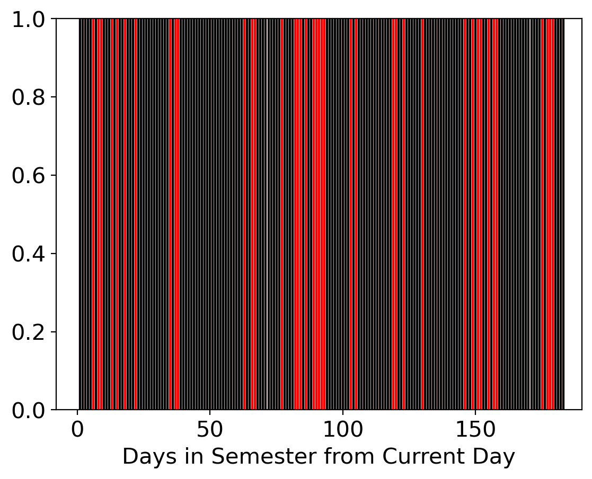

.. _getting_started:

Getting Started
===============

.. _installation:

Installation
++++++++++++

    
Installing Gurobi
------------------

``AstroQ`` relies on the Gurobi optimization software to efficiently solve large matrix equations.
Follow these steps to install and set up Gurobi:

    1. **Create an Account** on Gurobi's `registration site <https://portal.gurobi.com/iam/register/>`_. Select that you are an "Academic," type in your home institution, and submit the form via "Access Now." You will receive an email to complete the registration.
    
    2. **Download Gurobi** for your OS from `this download page <https://www.gurobi.com/downloads/gurobi-software/>`_. Follow the instructions to run the installer file.
    
    3. **Request an Academic License** from your `user portal <https://portal.gurobi.com/iam/login/?target=https%3A%2F%2Fportal.gurobi.com%2Fiam%2Flicenses%2Frequest%2F>`_ *while connected to a university network*. You want the 'Named-User Academic License,' which has a one-year lifetime. At the end of the year, you can obtain a new license easily within your account (and for free) as long as you have maintained your academic status.
    
    4. **Retrieve the License** by running the command given in the popup window in a shell. It should look like:
        .. code-block:: bash

            $ grbgetkey 253e22f3...
        
    This command will download a file called ``gurobi.lic`` to your machine.
    
    5. **Define the GRB_LICENSE_FILE environment variable** by adding the following to your ``.zshrc`` file:
        .. code-block:: bash

            export GRB_LICENSE_FILE=/path/to/gurobi.lic
            
    6. **Optionally define some additional environment variables** while you're at it:
    
        .. code-block:: bash

            export KPFCC_JUMP_USERNAME=your_username
            export KPFCC_JUMP_PASSWORD=your_pass
            export KPFCC_SAVE_PATH=path/to/AstrQ/results

Installing AstroQ
------------------

We recommend installing ``AstroQ`` within a new 
`Anaconda <https://www.anaconda.com/download>`_ environment. 
To do so, clone the `AstroQ Github repository <https://github.com/jluby127/AstroQ>`_ 
and run the following commands in the top-level directory:

    .. code-block:: bash

        $ conda env create --name astroq --file environment.yml
        $ conda activate astroq

Then install the package:
        
    .. code-block:: bash

        $ pip install -e .
        
        
Installation Test
------------------
        
Run ``pytest`` from your terminal to execute a suite of tests verifying that the installation was successful:

    .. code-block:: bash

        $ pytest

This may take a few minutes on the first run. The desired result is that all tests pass successfully.
        
Temporary note: you can also run ``coverage`` to see how much code the tests touch:

    .. code-block:: bash

        $ coverage run -m pytest
        

Example Usage
+++++++++++++

Test your installation further by running some of the commands below. We will use ``AstroQ``'s command line interface to mock up a toy observing schedule. After performing the steps in the :ref:`installation` section, you should have access to the ``astroq`` binary at the command line. If not, ensure that you have run ``pip install -e .`` in the top-level directory of the repository.

Let's see which subcommands are available using ``astroq --help``:
    .. code-block:: bash

        $ astroq --help
          usage: astroq [-h] [-V] {bench,plot,schedule,kpfcc} ...

          AstroQ: Optimized observation scheduling

          optional arguments:
              -h, --help            show this help message and exit
              -V, --version         Print version number and exit.

          subcommands:
              {bench,plot,schedule,kpfcc}

To create your mock observing schedule, first run the ``kpfcc build`` command given below. <There should be example files that the user has immediate access to, e.g. in the example/ directory.>

    .. code-block:: bash

        $ astroq kpfcc build -cf <path to config file>
        $ astroq schedule -cf <path to config file> -ff <path to request set file>
        $ astroq plot -cf <path to config file>
        
This will produce a set of files in the `<FILL THIS IS>` directory, including a plot called `weather_loss_visualization.png` that looks this:

        
        
        
        
