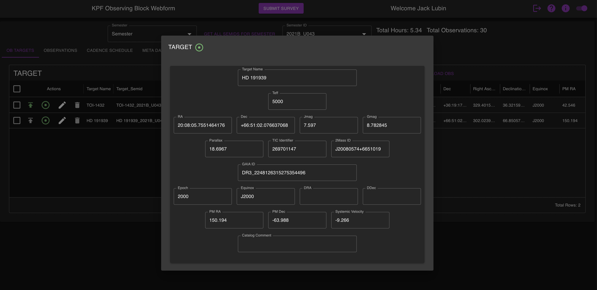
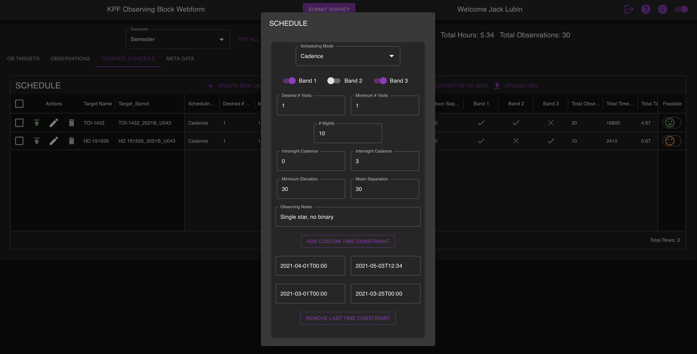

.. _ob_construction:

OB Construction
===============

While AstroQ is designed to be easily adaptable to any observatory, itw as built to power the KPF-CC program at Keck Observatory. With this in mind, we dedicate this page to describing in detail how PIs of Keck programs can submit their requests to the KPF-CC queue.

KPF observations are executed through ``Observing Blocks (OBs)``. ``OBs`` are the basic units of information that configure the instrument for the observation. See this page for more detailed information about OBs: https://www2.keck.hawaii.edu/inst/kpf/buildingOBs/.

The KPF-CC program builds off of the existing ``OB`` architecture by adding an additional family of fields to encode the observational strategy of the target. While all KPF observations require an ``OB``, all KPF-CC observations require these additional fields. 

``OBs`` can be constructed through the OB Submission Webform that the observatory hosts. Log in through your Keck Observers account, scroll towards the bottom to access the link titled "Submit KPF Community Cadence Targets":

There, you will have access to all cover sheets for which you are the PI or a named Co-I. You can use the UI to create new OBs, easily adding stellar parameters on the "Target" tabfrom an API call to Simbad (use the green bullseye button):

and then add your observational strategy information under the "Cadence Scheduling" tab.

For advanced users, you can also submit OBs through the API. This requires having a json file that conforms to the ``OB`` schema. Below is an example of a valid ``OB`` file with annotations. Note that any annotations in the file will cause the API to reject the file.

.. code-block:: javascript

    [                                                        This file is a list of json objects. Wrap the json in square brackets.  
        {                                                    The individual OB starts here.
            "calibration": {},                               It is recommended that you not modify this section without speaking to the KPF Instrument Scientist.
            "schedule": {                                    The Schedule section defines your observational strategy. This is an optional section for KPF, but it is required for KPF-CC. 
                "SchedulingMode": "Cadence",                 Leave as is. 
                "DesiredVisitsPerNight": 1,                  The maximum number of visits to observe the target within one night. Not all nights are long enough to achieve the desired number of visits. See below.
                "MinVisitsPerNight": 1,                      The minimum number of visits to observe the target within one night. This represents how many visits you will accept before it is no longer scientifically useful.
                "NightsPerSemester": 20,                     The number of unique nights in the semester to observe the target.
                "interNightCadenceMin": 3,                   The minimum number of days that must elapse after an observation before the next observation can be scheduled/observed.
                "intraNightCadenceMin": 0,                   The minimum number of hours that must elapse after an visit before the next visit within the same night can be scheduled/observed.
                "MinimumElevation": "30",                    The minimum elevation, in degrees, above the horizon for observing this star. Note the K1 pointing limits: https://www2.keck.hawaii.edu/inst/common/TelLimits.html
                "MinimumMoonSeparation": "30",               The minimum moon separation, in degrees. Unless you have specific science requirements, we suggest 30 degrees as default.
                "weather_band_1": true,                      Allow observation in weather band 1 (note: all KPF-CC OBs must be allowed in band1), when slowdown is <2x
                "weather_band_2": true,                      Allow observation in weather band 1 (note: all KPF-CC OBs must be allowed in band1), when slowdown is between 2x - 4x
                "weather_band_3": false,                     Allow observation in weather band 1 (note: all KPF-CC OBs must be allowed in band1), when slowdown is >4x
                "comment": "single star, no binary",         Optional. A comment field for the observers. This is where you should specify acquisition instructions, like which binary component to observe for example.
                "custom_time_constraints": [                 Optional. PIs may constrain their observations to take place within a specific time window for any scientific reason. Submit windows like this. Ensure timestamp formatting is correct.
                    {
                    "end_datetime": "2025-06-19T12:30",
                    "start_datetime": "2025-05-19T12:30"
                    },
                    {
                    "end_datetime": "2025-02-08T18:00",
                    "start_datetime": "2025-02-04T06:15"
                    }
                ]
                },
            "target": {                                      The Target section describes stellar parameters
                "TargetName": "HD 191939",                   A human readable star name
                "GaiaID": "DR3_2248126315275354496",         The Gaia ID, preferably DR3. Optional but highly encouraged
                "twoMASSID": "J20080574+6651019",            optional
                "tic_id": "269701147",                       optional
                "Parallax": 18.6967,                         optional (units of millearcseconds)
                "RadialVelocity": -9.266,                    optional, but assists in the RV calculation (units of km/s)
                "Gmag": 8.782845,                            G magnitude, assists observers in finding the star
                "Jmag": 7.597,                               J magnitude, sets the guide camera filter
                "Teff": 5590,                                Stellar temperature, helps the KPF DRP set the binary mask for CCF calculation
                "RA": "20:08:05.7551464176",                 Right Ascension 
                "DEC": "+66:51:02.076637068",                Declination
                "Equinox": "J2000",                          Equinox for coordinate zero point
                "PMRA": 150.194,                             Proper motion in RA (millearcseconds per year)
                "PMDEC": -63.988,                            Proper motion in Declination (millearcseconds per year)
                "Epoch": 2000                                Epoch for proper motion zero point
            },
            "observation": {                                 The Observation section sets the instrument configuration during the exposure. Talk to the KPF Instrument Scientist for more information.
                "Object": "HD 191939",                       Does not have to match the TargetName above, but this is the name that will be written to in the KOA
                "nExp": 1,                                   Number of exposures to take during a single visit
                "ExpTime": 1,                                Desired exoposure time in seconds
                "TriggerCaHK": true,                         Use the CaHK spectrograph 
                "TriggerGreen": true,                        Use the Green spectrograph 
                "TriggerRed": true,                          Use the Red spectrograph 
                "ExpMeterMode": "monitor",                   Options: "monitor", 
                "AutoExpMeter": true,                       
                "ExpMeterExpTime": 1,                        Do not change.
                "ExpMeterThreshold": 50000,                  Cutoff SNR. Units of Megaphotons/Angstrom. Required if you want to participate in band2 or band3. See this page: https://www2.keck.hawaii.edu/inst/kpf/expmetertermination/
                "TakeSimulCal": true,
                "AutoNDFilters": true,
                "CalND1": "OD 0.1",
                "CalND2": "OD 0.1",
                "GuideHere": true
            },
            "metadata": {                                    The metadata section contains information about your program.
                "ObserverID": 1234,                          Your unique Keck Observer ID can be found on your Observer page.
                "ObserverName": "Star E. Sky",               Your name here
                "Semid": "2001B_U043",                       The semester and program ID together
                "Semester": "2001B",                         Just the semester
                "Progid": "U043",                            Just the program ID
                "Tags": [],                                  Ignore
                "ob_feasible": true,                         Ignore
                "Submitter": "Star E. Sky",                  Do not touch
                "submitted": true,                           Do not touch
                "details": "Passed all infeasibility checks",  Do not touch
                "status": "SUCCESS",                         Do not touch
                "state": "OBSERVING_BLOCK_SUBMITTED"         Do not touch
            }
        }      if you want to submit more OBs simultaneously, add a comma here and copy the above. Repeat as needed.
    ]          end with the closing square bracket.

Using this template, you can use whatever tools you like to construct OBs with your target information.

.. note::
   You can download the unannotated template JSON file here:

   :download:`template_OB.json <../data/template_OB_annotated.json>`